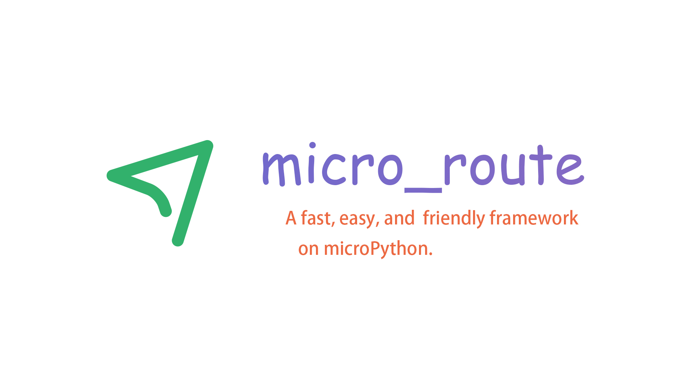

# micro_route
简体中文 | [English](https://micro-route.m-jay.cn/docs/en/)

[项目官网 | Project website](https://micro-route.m-jay.cn/)

[开发文档 | Document](https://micro-route.m-jay.cn/docs/)



## Notice!
This framework has been deprecated and will be replaced by a new project.
The new project is [micropython-urouter](https://github.com/Li-Lian1069/micropython-urouter)

## 注意!
本框架目前已经被废弃，将由新的项目代替 [micropython-urouter](https://github.com/Li-Lian1069/micropython-urouter)

## I need help

I am not expert at English, so i need someone who is good at English helping me to translate the document into English.

## 这是什么

这是一个工作在 `micropython` 上的一个轻量, 简单, 快速的WEB框架。

为什么要开发这个框架?

据我所知, 目前已知的可以在 `micropython` 上运行的 web 框架有[microWebSrv](https://github.com/jczic/MicroWebSrv), 但是这个框架需要 `_thread` 模块的支持

但, 很遗憾的是, 在类似于 `esp8266` 这样的板子上并没有该模块的支持.

同时, 这个模块的运行需要阻塞主线程, 这就意味着你的程序只能作为单一的服务器, 而不能处理其他的事情.

因此, 我们需要一个支持单线程运行, 而且不会阻塞主线程的web框架, 于是这个框架应运而生.

## 与 microWebSrv 的对比

| 特性/框架      | micro_route | microWebSrv |
| -------------- | ----------- | ----------- |
| python习惯命名 | *           |             |
| 单线程支持     | *           | *           |
| 多线程支持     | *           | *           |
| 非阻塞支持     | *           |             |
| 多对象支持     | *           |             |
| 学习成本       | 低          | 高          |
| 复杂程度       | 简单        | 复杂        |

我们的目标是提供一个简单快速可维护的web服务, 我们会尽量**简化代码, 减少api接口**, 但是保留绝大部分的自定义功能给予开发者使用.

最能体现 `micro_route`  简洁这一特性的地方在于, `micro_route` 只提供了几个简单的函数, 而与之对比的 `microWebSrv` 则提供了太多让人眼花缭乱的参数, 能够使用几个最简单的参数完成绝大部分事情是我们的**优势**.

## 如何使用

### 安装

首先你需要去 [Releases](https://github.com/Li-Lian1069/micro_route/releases) 中下载一个后缀名为 .mpy 的文件, 然后上传到你的开发版中.

**切记不要把 `micro_route.py` 和 `micro_route.mpy` 放到同一个文件夹, micropython会选择性的只选择 `micro_route.py` 来执行**

**注意!!不要使用 `micro_route.py` 作为导入的对象, 这是没有经过编译优化的源码, 可能会导致编译时的内存不足而导致失败**

### 使用

#### 一个简单的例子:

```python
# main.py
import micro_route, network

# connect to network
WLAN = network.WLAN (network.STA_IF)
WLAN.active (True)
WLAN.connect ("SSID","PASSWD")

# set the web route
app = micro_route ()
@app.route ('/')
def index (context):
    return "<h1>Hello World!</h1>"

app.run ()
```

当你访问 `IP/` 时, 就可以看见浏览器上显示的 "Hello World!" 了.

#### 魔法路径

```python
@app.route ('/goods/<string:goods_name>/')
def check_goods (context,goods_name:str):
    ...
```

在上面的例子中, 我们定义了一个变量 `goods_name` , 而且它会被识别并传入到 `goods_name` 参数中**(请确保两者的命名相同)**

魔法路径支持的类型有:

- string
- int
- float (包括 int )
- path
- custom (使用用户自定义的regex规则, 详见开发文档)

魔法路径书写规则: `<type:var_name>`

**请确保你的 `var_name` 和你函数中所填的参数名称一致**

#### context

你可能注意到, 我们定义的处理函数中都必须带有一个 `context` 的参数, 这是 `micro_route` 为你创建的上下文对象, 其中包括 `request`, `response`, `session(尚未实现)` 三个对象.

`request` 用来获取用户的信息, 例如: url, 访问方式, 表单数据, 参数, headers 等等

`response` 用来对客户的访问进行相应, 如果你不想使用 `return` 的方式简单传输文本, 你也可以使用 `response` 中自带的一些方法来进行自定义高级处理.

`session` 用来保存和操作用户的数据 (开发中)

关于以上对象的详细数据, 详见开发文档

#### 更多有关特性请前往文档查看

## IDE 支持

没有IDE支持的开发显然是很难受的, 我建议你在 VSCODE 中安装 `RT-Thread` 插件, 这个插件提供了 `micropython` 的代码提示, 亦或是你有其他的选择也可以.

**切记不要把 `micro_route.py` 和 `micro_route.mpy` 放到同一个文件夹, micropython会选择性的只选择 `micro_route.py` 来执行**

如果你想启用 IDE 的提示和补全功能, 我建议你使用 `RT-Thread` 的单文件上传功能, 只把 `micro_rout.mpy` 上传到你的开发版中, 这样你就可以启用 IDE 的代码补全和提示了.

